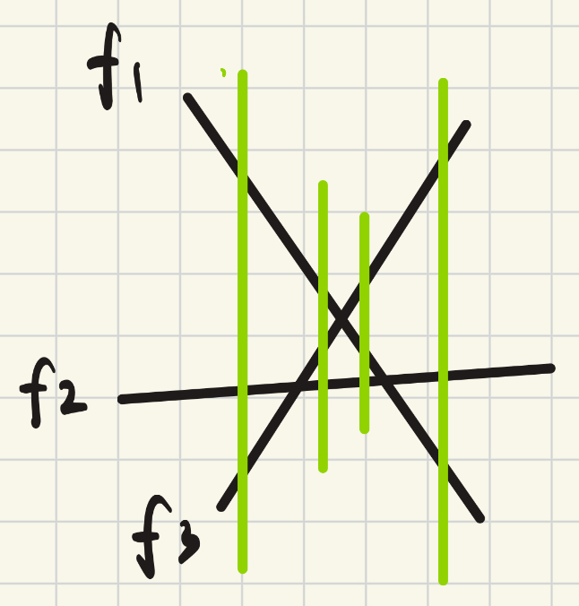
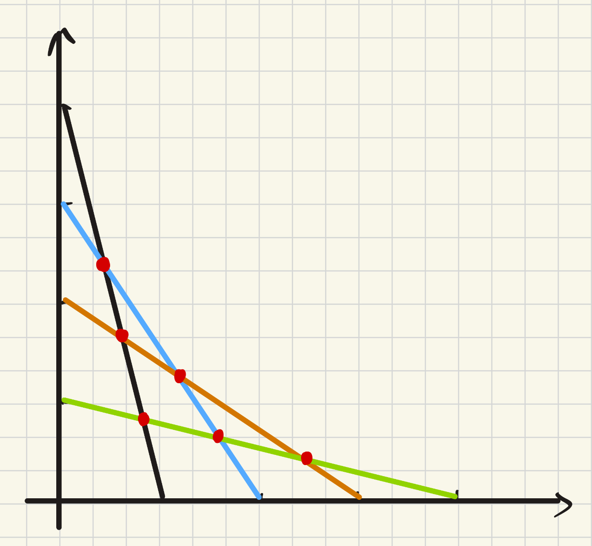

## exercise1
we can find the rules by enumerate the number from 1 to 12, noting that 6k will win (Bob), else will lose (Alice)
**Proof**:
1. $p^k$ will not devided by 6
2. when $n = 6k+r , r \in (1,2,3,4,5)$ , for any r, it can be expressed by $p^k$ : 1=$2^0$, 2=$2^1$, 3=$3^1$, 4=$2^2$, 5=$5^1$
3. that means:
- if now there are 6's stones, after taking $p^k$, $6k-p^k$ will not be 6's
- if now there are 6k+r stones, after taking r, the remaining can be 6's
4. so if n=6k, however Alice takes, Bob will have 6k+r, then Bob can take r to leave Alice 6k... When it decreasing, Bob finally will leave Alice a 0=6*0, meaning Bob wins
if n=6k+r , Alice can first takes r to remains 6k then Alice can win

## exercise2

case study：对于三条直线的情况，我们可以列出每条绿色线从上到下的顺序分别为[1,2,3]->[1,3,2]->[3,1,2]->[3,2,1]
**没有三线共点**
1. 给n条直线按斜率从小到大赋予序号1、2、3、...、n。题目说了每两条直线都会有一个交点，根据直线斜率和极限相关的性质，可以知道在最左侧一定是斜率最大的在最下面，斜率最小的在最上面，按斜率排序（不然满足不了每两条线都有交点的条件），从上往下为[1,2,...,n-2,n-1,n],最右侧为[n,n-1,n-2,...,2,1]
2. 每个节点相当于两个相邻直线发生了交换，经过有限次交换从初始的顺序到最终状态的倒序。第k列数字变换的次数即为第k层的线段数
3. **因此问题转化为从[1,2,...,n-2,n-1,n]经过多次只能在相邻位置交换的操作，变到[n,n-1,n-2,...,2,1]的整个过程中，第k列数字变化的最少次数**
4. 先考虑k<(n+1)/2，即k更靠近中间偏左的位置，由于需要实现完全反转，1 ~ （k-1）共k-1个数肯定是要经过k到达对称的右边位置。而对于（k+1） ~ （n-k），也就是从中间到k对称位置的区域，他们实现反转可以自己内部交换。 对于（n+1-k）~ n 共k个数，这部分也是要经过第k列到达1 ~ （k-1）的位置。再加上k本身，第k层至少会有k-1+k+1=2k个数，也就是说第k层最少线段数>=2k
5. 对于k>(n+1)/2，可以将图上下翻转，实际上就是对称过来了（因为求最小值），所以是>=2(n+1-k)
6. 对于k=(n+1)/2，1 ~ （k-1），（k+1）~ n 两个区间，加上k本身一开始在，结束也在（算2段，因为中间会变化），共$k-1+n-k+2=n+1=2k$段
7. 因此我们可以确定第k层最少线段数>=2min(k,n+1-k)
8. 下面构造出=2k的情况

从初始点往右上方即为层数递增
由于我们能构造出2min(k,n+1-k)的情况，也许有更少的情况未构造出来，因此说明最少线段数<=2min(k,n+1-k)

