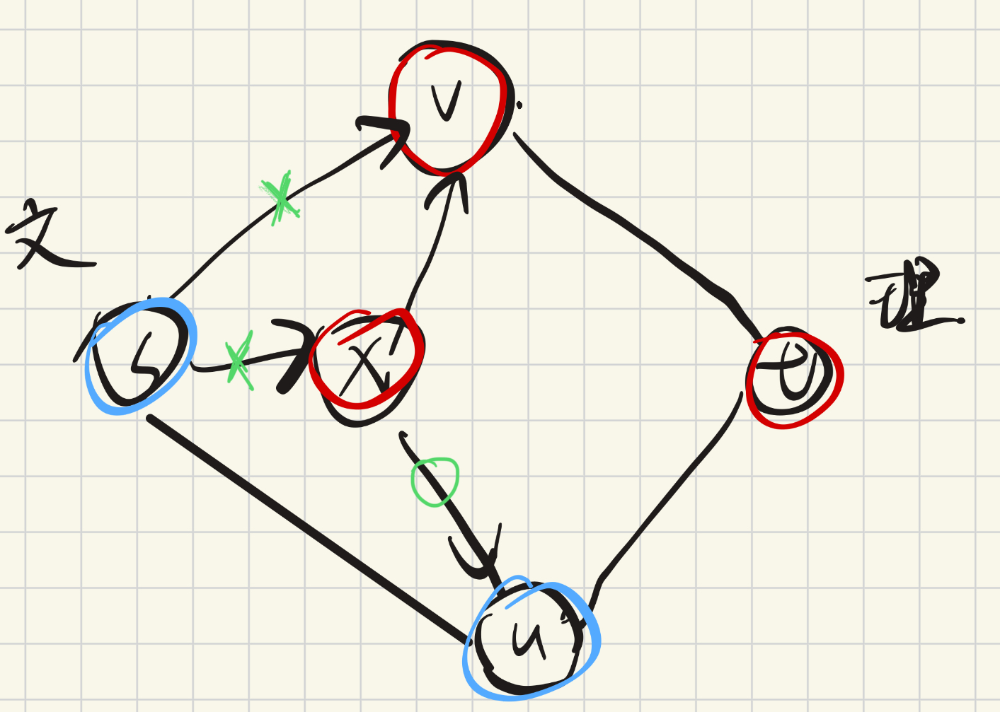

## exercise1
### 题意
最小费用最大流问题，且容量限制在点上
### 解法
1. 将点容量限制转换成边容量限制：对于点v，且容量限制为cap(v)，存在边u1 -> v 代价为c1, v -> u2 代价为c2。 
   则将v拆成两个点v_in , v_out。新构成的边中， u1->v_in 的代价为c1，容量限制为1; v_in->v_out 的代价为0，容量限制为1 ; v_out->u2 的代价为c2，容量限制为1
2. 每条边构建反向边，初始容量限制为0，代价为0。当被推流之后，容量限制为pushes，代价为-c
3. while 有路从s->t， SPFA找到代价最小的路(因为代价可以为负，所以要负权最短路算法)，然后推流更新

## exercise2 (同P1646)
### 最小割
将点分为点集A，B。其中A必须包含s，B必须包含t。选择一种点的分配方式，使所有A指向B的边的边权之和最小
**B指向A的边权不考虑**
### 解法
把每个人选各科的快乐程度、和邻居的额外快乐程度全部加到sum里。然后想办法把不选中的快乐程度去掉，找出一种去除方法，使去掉的最少，这转化为最小割问题。
0. 新建辅助点s、t
1. 对于每个人v，增加边w(s,v)=选文科的快乐程度，w(v,t)=选理科的快乐程度。
由于v必须属于A、B其中一方，那么上述两条边必有一边断掉，符合一个人只能选一科的题设
2. 对于两个人u、v，增加辅助节点x，w(s,x)=两人同时选文的额外快乐，w(x,u)=w(x,v)=INF。
- 若两人都选文，那么u、v都属于A，则x属于A时(s,x)就不用断，等价于保留额外快乐
- 若两人都选理，那么u、v都属于B，则x属于B，(s,x)必须断，则相当于删去这个快乐。
- 若u选文，v选理，则u属于A，v属于B。此时若x属于A，必然会断INF，算法会避免。因此x属于B，此时(s,x)断，意味失去这份快乐。注意到(x,u)也会断，但这是B指向A的边，因此不会计入代价，没问题。
3. 同理，对于两个人u、v，增加辅助节点y，w(y,t)=两人同时选理的额外快乐，w(u,y)=w(v,y)=INF。

再通过将最小割转化为最大流问题，调用dinitz算法即可
