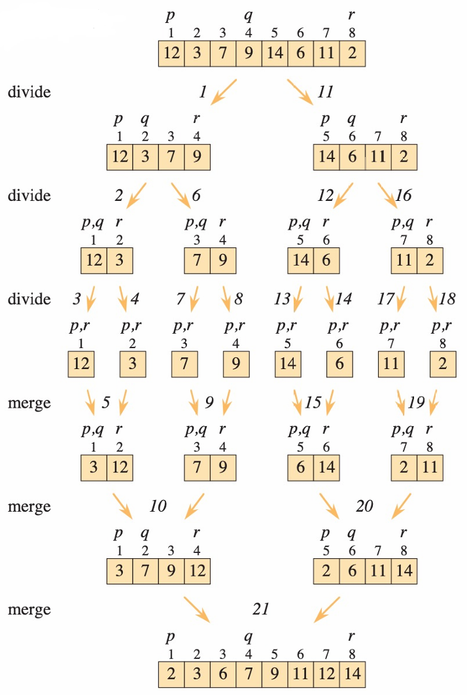
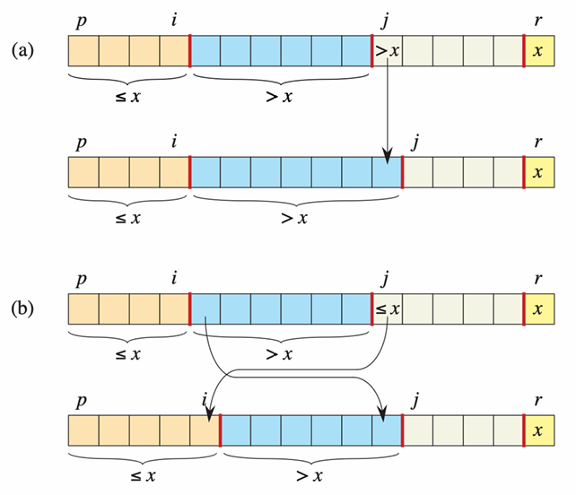
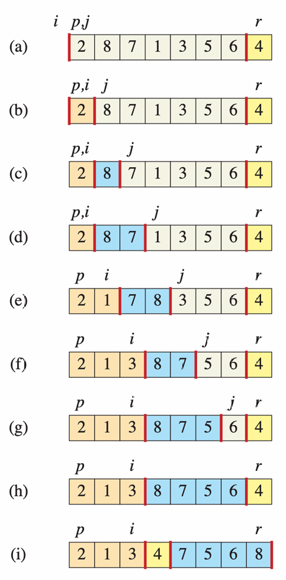
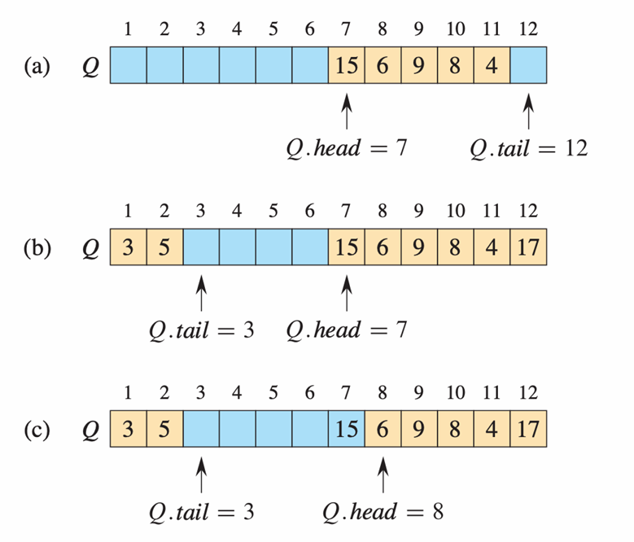

[TOC]

---
# Sorting
## CPP's Sorting is QuickSort
```cpp
#include<algorithm>
sort(arr.begin(),arr.end()); //increasing order
sort(arr.begin(), arr.begin() + 4) //increasing for the first 4 elements

#include <functional>
sort(arr.begin(), arr.end(), greater<int>())  //decreasing order

// design the sorting rules for a struct or class: by overloading the < operator
// in struct or class
bool operator<(const Node& other) const {
    // It is sorted by score in decending order, when scores are same, small id will be ahead
    if (score != other.score) {
        return score > other.score; //higher score will be ahead
    }
    return id < other.id;
}
// when using sort, you can directly call sort(arr.begin(),arr.end())

//another method is using lamda expression
std::sort(arr.begin(), arr.end(), [](const student& a, const student& b) {  //[] can put other variables to use in the sorting rule design
    if (a.score != b.score) {
        return a.score > b.score; 
    }
    return a.id < b.id;
});


```
## SelectionSort
**idea**：from head to bottom，exchange the current element with the smallest elements behind it in every iteration，ensuring the first i element is the smallest i elements in the array and in order
```cpp
void SelectionSort(vector<int>& arr,int n){
    for(int i=0;i<n-1;i++){
        int key=i;
        for(int j=i+1;j<n;j++){
            if(arr[j]<arr[key]){
                key=j;
            }
        }
        swap(arr[i],arr[key]);
    }
}
```
==similar to BubbleSort==
**Time Complexity：$\Theta(n^2)$**

## InsertionSort
**idea**：It divides the array into 2 parts:sorted array and pending array. It compares the current element with the sorted elements in each iterations, then insert it into the suitable place(between the larger element and the smaller element) in the sorted array, forming a new sorted array.
```cpp
void InsertionSort(vector<int>& arr,int n){
    for(int i=1;i<n;i++){
        int key=arr[i];
        int j=i-1;
        while(j>=0&&arr[j]>key){
            arr[j+1]=arr[j];
            j--;
        }
        arr[j+1]=key;
    }
}
```
**Time Complexity: $\Omega(n),O(n^2)$**

## MergeSort
**idea**：Divide and conquer. Devide the array into 2 parts constantly until it has been to a single element, then gradually conquer two sorted arrays into a larger sorted array.
```cpp
#include <climits>
void Merge(vector<int>& arr,int p,int q,int r){
    left[q-p+1]=INT_MAX;
    right[r-q]=INT_MAX;
    for(int i=0;i<q-p+1;i++){
       left[i]=arr[i+p];
    }
    for(int j=0;j<r-q;j++){
        right[j]=arr[j+q+1];
    }
    left[q-p+1]=INT_MAX; //guard
    right[r-q]=INT_MAX;  //guard
    int i=0;
    int j=0;
    for(int k=p;k<=r;k++)
    if(left[i]<right[j]){
        arr[k]=left[i];
        i++;
    }else{
        arr[k]=right[j];
        j++;
    }
}
void MergeSort(vector<int>& arr,int p,int r){
    if(p>=r) return;
    int q=(p+r)/2;
    MergeSort(arr,p,q);
    MergeSort(arr,q+1,r);
    Merge(arr,p,q,r);
}
```

**Time Complexity: $\Theta(nlogn)$**

## HeapSort
**idea**：Build a max-heap at the beginning. Every time exchange the element at the top of the heap with the one at the bottom, and heapsize--, maintaining the last max-heap property.
```cpp
//1-base heapsort
//turn the element and the subtrees under it into a max-heap. Notice that it must satisfy that two subtress has been max-heap already.
void MaxHeapify(vector<int>& arr,int x,int heapsize){
    int l=2*x;  //left child
    int r=2*x+1;  //right child
    int largest;  
    //to find the largest element between it and two childern
    if(l<=heapsize&&arr[x]<arr[l]){
        largest=l;
    }else{
        largest=x;
    }
    if(r<=heapsize&&arr[largest]<arr[r]){
        largest=r;
    }
    if(x!=largest){
        swap(arr[x],arr[largest]);
        MaxHeapify(arr,largest,heapsize);
    }
}

//build  the max-heap
void BuildMaxHeap(vector<int>& arr,int heapsize) {
    for(int i=heapsize/2;i>=1;i--){
        MaxHeapify(arr,i,heapsize);
    }
}
void HeapSort(vector<int>& arr,int heapsize){
    BuildMaxHeap(arr,heapsize);
    while(heapsize>1){
        swap(arr[1],arr[heapsize]);
        heapsize--;
        MaxHeapify(arr,1,heapsize);
    }
}
```
**Time Complexity: $\Theta(nlogn)$**

## QuickSort
**idea**：Divide and conquer. Select the last element in the array as a pivot. In the array, put the elements smaller than the pivot in the left, and put the larger elements in the right, put the pivot between these two arrays. Continually repeat the same operations to the left and right arrays.
```cpp
int Partition(vector<int>& arr,int p,int r){
    int pivot=arr[r];
    int i=p-1;
    for(int j=p;j<r;j++){
        if(arr[j]<pivot){
            i++;
            swap(arr[i],arr[j]);
        }
    }
    swap(arr[i+1],arr[r]);
    return i+1;
}
void QuickSort(vector<int>& arr,int p,int r){
    if(p>=r) return;
    int q=Partition(arr,p,r);
    QuickSort(arr,p,q-1);
    QuickSort(arr,q+1,r);
}
```
**Time Complexity: $\Omega(nlogn),O(n^2)，Average: \Theta(nlogn)$**



### Randomised QuickSort
There might be some extremely unbalanced conditions, causing the time degenerate to $n^2$. We can randomly select the pivot, which is called Randomised QuickSort to avoid the worst case, making the time average time complexity still be $\Theta(nlogn)$, and no one can find the worst case.
**idea**：
```cpp
#include <random>
//random number generator
int randomInt(int a,int b){
    static random_device rd;
    static mt19937 gen(rd());
    uniform_int_distribution<int> dis(a, b);
    return dis(gen);
}
int Partition(vector<int>& arr,int p,int r){
    int pivot=arr[r];
    int i=p-1;
    for(int j=p;j<r;j++){
        if(arr[j]<pivot){
            i++;
            swap(arr[i],arr[j]);
        }
    }
    swap(arr[i+1],arr[r]);
    return i+1;
}
//randomly choose an index in the array, and exchange the element with the orginal pivot
int Randomised_Partition(vector<int>& arr,int p,int r){
    int i=randomInt(p,r);
    swap(arr[i],arr[r]);
    return Partition(arr,p,r);
}
void QuickSort(vector<int>& arr,int p,int r){
    if(p>=r) return;
    int q=Randomised_Partition(arr,p,r);
    QuickSort(arr,p,q-1);
    QuickSort(arr,q+1,r);
}
```

### 3-way QuickSort
==to avoid the problem of dealing with multiple identical elements inefficiently==
**idea**：divide the aray into 3 areas. (smaller area, equal area, larger area)
```cpp
pair<int, int> Partition(vector<int>& arr,int p,int r){
    int pivot=arr[r];
    int i=p-1; //arr[p] to arr[i]:smaller area
    int j=p;  //arr[i+1]to arr[j-1]:equal area
    //arr[j] to arr[m-1]:pending area，j as the pointer
    int m=r;  //arr[m] to arr[r]:larger area
    while(j<m){
        if(arr[j]<pivot){
            i++;
            swap(arr[i],arr[j]);
            j++;
        }else if(pivot==arr[j]){
            j++;
        }else{
            m--;
            swap(arr[j],arr[m]);
        }
    }
    swap(arr[r],arr[j]);
    return {i, j + 1};
}
void QuickSort(vector<int>& arr,int p,int r){
    if(p>=r) return;
    pair<int, int> bounds = Partition(arr, p, r);
    QuickSort(arr,p,bounds.first);
    QuickSort(arr,bounds.second,r);
}
```

## CountingSort
**idea**: initialise a new array to record the postiton for where the elements in the original array should be

```cpp
void CountingSort(vector<int>& arr){
    int max=-INT_MAX;
    int min=INT_MAX;
    int n=arr.size();
    for(int i=0;i<n;i++){
        if(arr[i]<min){
            min=arr[i];
        }
        if(arr[i]>max){
            max=arr[i];
        }
    }
    //to count the length of the count array
    int count_length=max-min+1; //IMPORTANT
    vector<int> count(count_length);
    for(int i=0;i<n;i++){
        count[arr[i]-min]++;
    }
    for(int i=1;i<count_length;i++){
        count[i]+=count[i-1];
    }
    vector<int> result(n);
    for(int i=n-1;i>=0;i--){
        result[count[arr[i]-min]-1]=arr[i];
        count[arr[i]-min]--;
    }
    for(int i=0;i<n;i++){
        arr[i]=result[i];
    }
}
``` 
==Stable Sort==
**Time Complexity**:$O(n+k),k=max-min+1$

## RadixSort
**idea**: Due to the CountingSort's stable quality, we can choose suitable base to divide the numbers into different digits, for every digits(from LSB to MSB) use CountingSort.
==Notice that it can only deal with non negative integers, so if you want to deal with negative one, you must first shift the all elements to nonegative, and recover it at last==
```cpp
//Base-256 RadixSort, which is used most frequently, since it is 0x..
void RadixSort(vector<int>& arr){
    int n=arr.size();
    int max=-INT_MAX;
    int min=INT_MAX;
    for(int i=0;i<n;i++){
        if(arr[i]<min){
            min=arr[i];
        }
        if(arr[i]>max){
            max=arr[i];
        }
    }
    for(int i=0;i<n;i++){
        arr[i]-=min;  //shift all numbers to positive(we will recover them later)
    }
    int ab_max=max-min;  
    vector<int> digit_rank(256);  //choose base-256
    vector<int> result(n);
    int round=0;
    //Important!!: num>>(8*x) means it use bit operation to shift right 8bit, which is equivalent to /10^8
    //num & 0xFF means it will only preserve the last 8 bit, achieving the goal of CountingSort of 0-255
    while(ab_max>>(round*8)>0){  //if the max number after shifting is still>0, then it needs one more CountingSort turn
        for(int j=0;j<n;j++){
            digit_rank[(arr[j]>>(8*round))&0xFF]++;
        }
        for(int j=1;j<256;j++){
            digit_rank[j]+=digit_rank[j-1];
        }
        for(int j=n-1;j>=0;j--){
            result[digit_rank[(arr[j]>>(8*round))&0xFF]-1]=arr[j];
            digit_rank[(arr[j]>>(8*round))&0xFF]--;
        }
        for(int j=0;j<n;j++){
            arr[j]=result[j];
        }
        for(int j=0;j<256;j++){
            digit_rank[j]=0;
        }
        round++;
    }
    for(int j=0;j<n;j++){
        arr[j]+=min;
    }
}
```
**Time Complexity**:$\Theta(d(n+k))=\Theta((n+k)\log_{k}M)$, M is the largest number in the array.
By base k, the largest number M has $log_{k}M$ digits. Since each digits $\in[0,k]$, so for each digit, the CountingSort takes $\Theta(n+k)$ times

---

# Elementary Data Structure

## Stack
**feature**: last in, first out
```cpp
template <typename T>
class Stack{
public:
    int size;
    T* arr;
    int top;
    Stack(int n){
        size=n;
        arr=new T[size];
        top=0;
    }
    void push(const T& x){
        if(top>=size){
            cout<<"overflow";
        }else{
            arr[top]=x;
            top++;
        }
    }
    void pop(){
        if(top-1<0){
            cout<<"underflow";
        }else{
            top--;
        }
    }
    ~Stack(){
        delete[] arr;
    }
};
```
==or directly use cpp's stack==
```cpp
#include <stack>
stack<T> s; //input the data type T for the stack
push(val);
pop();  //just remove
top();  //return the reference of the top element in the stack
empty();  //bool
size();
```

## Queue
**feature**: first in, first out
```cpp
template <typename T>
class Queue{
public:
    int size;
    T* arr;
    int front;
    int rear;
    int count;  //to distinguish overflow and underflow
    Queue(int n){
        size=n;
        arr=new T[size]; 
        front=0;
        rear=0;
        count=0;
    }
    void enqueue(const T& x){
        if(count==size){
            cout<<"overflow";
        }else{
            arr[rear]=x;
            count++;
            if(rear==size-1){
                rear=0;
            }else{
                rear++;
            }
        }
    }
    void dequeue(){
        if(count==0){
            cout<<"underflow";
        }else{
            count--;
            if(front==size-1){
                front=0;
            }else{
                front++;
            }
        }
    }
    ~Queue(){
        delete[] arr;
    }
};
```
==or directly use cpp's queue==
```cpp
#include <queue>
queue<T> q;  //input the data type T for the queue
push(val);  //enqueue the element to the rear
pop();  //dequeue the element at the front, void
front();  //return the reference at the front
back();  //return the reference at the rear
empty();  //bool
size();  
```


## Priotity_Queue
**feature**: a max-heap, pup will always take out the greatest element in $O(logn)$
```cpp
#include <queue>
priority_queue<T> max_pq;  //Max-Heap
max_pq.push(x);  //insert an element while maintaining the max-heap property
max_pq.pop();  //delete the greatest element while maintaining the max-heap property
max_pq.top();  //return the reference of the greatest element 

priority_queue<int, vector<int>, greater<int>> min_pq;  //Min-Heap for int
min_pq.push(x);
min_pq.pop();
min_pq.top();
// the priority_queue for a struct needs to overload the logic for comparing
Struct student{
    int score;
    string name;
    bool operator<(const& student other) const{
        return score<other.score; //max-heap, if a<b is true, than b will be put ahead of a
        // return score>other.score  min-heap
    }
}
```
- note: in priority_queue<T, vector<T>, greater<T>> min_pq, 3 parameters mean datatype, container, comparator.
container is always vector<datatype>, for the comparator great, a>b is true then a is not prior than b, so it's a min-heap.
- for pair<int,int>, it will first compare the first one, then the second one

## Linked_list
```cpp
#include <list>  //doubly linked list
list<T> list1;
list1.push_back(x);  //insert at the back
list1.push_front(y);  //insert at the front
list1.pop_back();
list1.sort_front();
for(T x:list1){}  
list1.merge();  //merge 2 sorted lists
list1.insert_after(list1.begin()+k,z);  //insert z after the (k+1)th element
auto it=list1.begin();  //Iterator(smart pointer), it++ means it->next. list1.begin() and list1.end() is two side
//*it can get the value or the object
it=list1.erase(it);  //delete the node it, and return the next pointer to it 

#include <forward_list>  //singly linked list, more efficient
forward_list<T> list2;
list2.push_front(x);
list2.pop_front()
```

## Hash Table
**feature**: It can get the value from the table by key in O(1), like the dictionary in Python. It's also similar to array, but the index become key, and the element become value.
```cpp
#include <unordered_map>
unordered_map<string,int> hash_table;  //key is string type, value is int type, it can also use other types even like queue
string s;
hash_table[s]=x; //if s is not in that unordered_map as key, it will create a key of s, and x be its value. if s has been in that unordered_map, it will change its correspondent value become x.
hash_table.erase(s); // delete the key-value pair which key=s
cout<<hash_table[s]<<endl;  //when you need to get the value, just use it like an array 
```

## Set
**feature**: Just like the set mathmatically, it's a set, similar to unordered_map but not values, only keys. They can be checked, insert, delete in O(1)
```cpp
#include <unordered_set>
unordered_set<int> myset;
myset.insert(10);
myset.erase(10);
myset.find(10); // true is in
```

## Union Find Set (disjoint set union, DSU)
**feature**: It can quickly check whether two nodes is connected in $O(\alpha(n))\approx O(1)$
The root for the set is the element whose parent is itself
The size of the set is stored in the size[root]

this version is only suitable for consistent integers (maybe with Offset(Pian Yi))

```cpp
struct DSU{
    vector<int> parent;
    vector<int> size; 
    
    DSU(int n) {  //already know how many elements will be in the set
        parent.resize(n);
        size.resize(n, 1); 
        for (int i = 0; i < n; i++) {
            parent[i] = i;
        }
    }

    int Find(int u){  //Path Compression: when searching for the root, we can set all the passing through nodes's parent be the root
        if(parent[u]==u){
            return u;
        }else{
            return parent[u]=Find(parent[u]);
        }
    }

    void Union(int a,int b){  //Union by size: always combine the smaller-size tree to the larger-size tree
        int a_ancestor=Find(a);
        int b_ancestor=Find(b);
        if(a_ancestor==b_ancestor){
            return;
        }
        int size_a=size[a_ancestor];
        int size_b=size[b_ancestor];
        if(size_a<size_b){
            parent[a_ancestor]=b_ancestor;
            size[b_ancestor]+=size[a_ancestor];
        }else{
            parent[b_ancestor]=a_ancestor;
            size[a_ancestor]+=size[b_ancestor];
        }
    }
};
```

## Binary Search Tree
**feature**: the left child is smaller that the current node, the right child is larger than the current node
```cpp
struct TreeNode{
    TreeNode* parent;
    TreeNode* left;
    TreeNode* right;
    int val;
    int cnt;
    int size;
    TreeNode(int x){
        parent=nullptr;
        left=nullptr;
        right=nullptr;
        val=x;
        cnt=1;
        size=1;  //the size represent the number of nodes in the subtree whose root is this node
    }
};

TreeNode* root=nullptr;  //define the initial root

void update_size(TreeNode* node){
    if(node!=nullptr){
        node->size=node->cnt;
        if(node->left!=nullptr){
            node->size+=node->left->size;
        }
        if(node->right!=nullptr){
            node->size+=node->right->size;
        }
    }
}

void Insert(TreeNode*& root,TreeNode* p,int x){
    if(root==nullptr){
        root=new TreeNode(x);
        root->parent=p;
        return;
    }
    if(x<root->val){
        Insert(root->left,root,x);
    }else if(x==root->val){
        root->cnt++;
    }else{
        Insert(root->right,root,x);
    }
    update_size(root);
};

TreeNode* Successor(TreeNode* root,int x){
    TreeNode* answer=nullptr;  //record the local optimal solution
    while(root!=nullptr){
        if(root->val>x){  //if current node is greater than x, it will be the best solution up to now
            answer=root;
            root=root->left;  //try to find whether there is a better solution in the left subtree
        }else{
            root=root->right;
        }
    }
    return answer;
}

TreeNode* Predecessor(TreeNode* root,int x){
    TreeNode* answer=nullptr;  //record the local optimal solution
    while(root!=nullptr){
        if(root->val<x){  //if current node is smaller than x, it will be the best solution up to now
            answer=root;
            root=root->right;  //try to find whether there is a better solution in the left subtree
        }else{
            root=root->left;
        }
    }
    return answer;
}

TreeNode* Search(TreeNode* root,int x){
    while(root->val!=x){
        if(root->val>x){
            root=root->left;
        }else{
            root=root->right;
        }
    }
    return root;
}

void Transplant(TreeNode*& root,TreeNode* node1,TreeNode* node2){
    if(node1->parent==nullptr){
        root=node2;
    }else if(node1==node1->parent->left){
        node1->parent->left=node2;
    }else{
        node1->parent->right=node2;
    }
    if(node2!=nullptr){
        node2->parent=node1->parent;
    }
}
 
void Delete(TreeNode*& root,int x){
    TreeNode* node1=Search(root,x);
    if(node1->cnt>1){
        node1->cnt--;
        while(node1!=nullptr){
            update_size(node1);
            node1=node1->parent;
        }
    }else{
        if(node1->left==nullptr){
            TreeNode* node2=node1->right;
            Transplant(root,node1,node2);
            if(node2==nullptr){
                node2=node1->parent;
            }
            while(node2!=nullptr){
            update_size(node2);
            node2=node2->parent;
            }
            delete node1;
        }else if(node1->right==nullptr){
            TreeNode* node2=node1->left;
            Transplant(root,node1,node2);
            if(node2==nullptr){
                node2=node2->parent;
            }
            while(node2!=nullptr){
            update_size(node2);
            node2=node2->parent;
            }
            delete node1;
        }else{
            TreeNode* node2 = Successor(root,x);
            TreeNode* node3= node2;
            if(node2!=node1->right){
                node3= node2->parent;
                Transplant(root,node2,node2->right);
                node2->right=node1->right;
                node2->right->parent=node2;
            }
            Transplant(root,node1,node2);
            node2->left=node1->left;
            node2->left->parent=node2;
            delete node1;
            
            while(node3!=nullptr){
            update_size(node3);
            node3=node3->parent;
            }
        }
    }
}

int smaller(TreeNode* root,int x){
    if(root==nullptr){
        return 0;
    }
    if(x<root->val){
        return smaller(root->left,x);
    }else if(x==root->val){
        if(root->left!=nullptr){
            return root->left->size;
        }else{
            return 0;
        } 
    }else{
        if(root->left!=nullptr){
            return root->left->size+root->cnt+smaller(root->right,x);
        }else{
            return root->cnt+smaller(root->right,x);
        } 
    }
}

TreeNode* rank_at_x(TreeNode* root,int x){
    int temp=0;
    if(root->left==nullptr){
        temp=0;
    }else{
        temp=root->left->size;
    }
    if(x<=temp){
        return rank_at_x(root->left,x);
    }else if(temp<x&&x<=temp+root->cnt){
        return root;
    }else{
        return rank_at_x(root->right,x-(temp+root->cnt));
    }
}
```
### Tree Walk
```cpp
// left -- root -- right
void Inorder(TreeNode* root,vector<int>& arr){
    if(root == nullptr){
        return;
    }
    Inorder(root->left,arr);
    arr.push_back(root->val);
    Inorder(root->right,arr);
}

// root -- left -- right
void Preorder(TreeNode* root,vector<int>& arr){
    if(root == nullptr){
        return;
    }
    arr.push_back(root->val);
    Preorder(root->left,arr);
    Preorder(root->right,arr);
}

// left -- right -- root
void Postorder(TreeNode* root,vector<int>& arr){
    if(root == nullptr){
        return;
    }
    Postorder(root->left,arr);
    Postorder(root->right,arr);
    arr.push_back(root->val);
}
```
1. Inorder: in sorted order
2. Preorder: copy tree, directory structure
3. Postorder: delete tree, calculate directory storage(Bottom-Up), Tree DP 

## AVL Tree(self-balancing tree)
**feature**: for every node v, $bal(v)<=1$ , $bal(v)=h(T_l)-h(T_r)$
```cpp
int get_height(TreeNode* node){
    if(node==nullptr){
        return 0;
    }else{
        return node->height;
    }
}

int get_size(TreeNode* node){
    if(node==nullptr){
        return 0;
    }else{
        return node->size;;
    }
}

void update(TreeNode* node){  //update the size and height
    if(node==nullptr){
        return;
    }else{
        node->height=max(get_height(node->left),get_height(node->right))+1;
        node->size=node->cnt+get_size(node->left)+get_size(node->right);
    }
}

int get_bal(TreeNode* node){
    if(node==nullptr){
        return 0;
    }
    return get_height(node->left)-get_height(node->right);
}

bool IsNotBalanced(TreeNode* node){
    return abs(get_bal(node)) > 1;
}

void Rotate(TreeNode*& root,TreeNode* node1){
    if(get_bal(node1)==2){
        if(get_bal(node1->left)>=0){  //LL
            TreeNode* node2=node1->left;
            if(node1==root){
                root=node2;
                node2->parent=nullptr;
            }else if(node1==node1->parent->left){
                node2->parent=node1->parent;
                node1->parent->left=node2;
            }else if(node1==node1->parent->right){
                node2->parent=node1->parent;
                node1->parent->right=node2;
            }
            node1->parent=node2;
            node1->left=node2->right;
            if(node2->right!=nullptr){
                node2->right->parent=node1;
            }
            node2->right=node1;
            update(node1);
            update(node2);
            }else{  //LR
            TreeNode* node2=node1->left;
            TreeNode* node3=node2->right;
            if(node1==root){
                root=node3;
                node3->parent=nullptr;
            }else if(node1==node1->parent->left){
                node3->parent=node1->parent;
                node1->parent->left=node3;
            }else if(node1==node1->parent->right){
                node3->parent=node1->parent;
                node1->parent->right=node3;
            }
            node2->right=node3->left;
            if(node3->left!=nullptr){
                node3->left->parent=node2;
            }
            node1->left=node3->right;
            if(node3->right!=nullptr){
                node3->right->parent=node1;
            }
            node2->parent=node3;
            node3->left=node2;
            node1->parent=node3;
            node3->right=node1;
            update(node1);
            update(node2);
            update(node3);
        }
    }else if(get_bal(node1)==-2){
        if(get_bal(node1->right)<=0){  //RR
            TreeNode* node2=node1->right;
            if(node1==root){
                root=node2;
                node2->parent=nullptr;
            }else if(node1==node1->parent->left){
                node2->parent=node1->parent;
                node1->parent->left=node2;
            }else if(node1==node1->parent->right){
                node2->parent=node1->parent;
                node1->parent->right=node2;
            }
            node1->parent=node2;
            node1->right=node2->left;

            if(node2->left!=nullptr){
                node2->left->parent=node1;
            }
            node2->left=node1;
            update(node1);
            update(node2);
        }else{  //RL
            TreeNode* node2=node1->right;
            TreeNode* node3=node2->left;
            if(node1==root){
                root=node3;
                node3->parent=nullptr;
            }else if(node1==node1->parent->left){
                node3->parent=node1->parent;
                node1->parent->left=node3;
            }else if(node1==node1->parent->right){
                node3->parent=node1->parent;
                node1->parent->right=node3;
            }
            node2->left=node3->right;
            if(node3->right!=nullptr){
                node3->right->parent=node2;
            }
            node1->right=node3->left;
            if(node3->left!=nullptr){
                node3->left->parent=node1;
            }
            node2->parent=node3;
            node3->right=node2;
            node1->parent=node3;
            node3->left=node1;
            update(node1);
            update(node2);
            update(node3);
        }
    }
}

void Insert(TreeNode*& node,TreeNode* p,int x){
    if(node==nullptr){
        node=new TreeNode(x);
        node->parent=p;
        return;
    }
    if(x<node->val){
        Insert(node->left,node,x);
    }else if(x==node->val){
        node->cnt++;
    }else{
        Insert(node->right,node,x);
    }
    update(node);
    if(IsNotBalanced(node)){
        Rotate(root,node);
    }
};

void Delete(TreeNode*& root,int x){
    TreeNode* node1=Search(root,x);
    if(node1->cnt>1){
        node1->cnt--;
        while(node1!=nullptr){
            update(node1);
            node1=node1->parent;
        }
    }else{
        if(node1->left==nullptr){
            TreeNode* node2=node1->right;
            Transplant(root,node1,node2);
            if(node2==nullptr){
                node2=node1->parent;
            }
            while(node2!=nullptr){
            update(node2);
            TreeNode* temp=node2;
            node2=node2->parent;
            if(IsNotBalanced(temp)){
            Rotate(root,temp);
            }
            }
            delete node1;
        }else if(node1->right==nullptr){
            TreeNode* node2=node1->left;
            Transplant(root,node1,node2);
            if(node2==nullptr){
                node2=node2->parent;
            }
            while(node2!=nullptr){
            update(node2);
            TreeNode* temp=node2;
            node2=node2->parent;
            if(IsNotBalanced(temp)){
            Rotate(root,temp);
            }
            }
            delete node1;
        }else{
            TreeNode* node2 = Successor(root,x);
            TreeNode* node3= node2;
            if(node2!=node1->right){
                node3= node2->parent;
                Transplant(root,node2,node2->right);
                node2->right=node1->right;
                node2->right->parent=node2;
            }
            Transplant(root,node1,node2);
            node2->left=node1->left;
            node2->left->parent=node2;
            delete node1;
            
            while(node3!=nullptr){
            update(node3);
            TreeNode* temp=node3;
            node3=node3->parent;
            if(IsNotBalanced(temp)){
            Rotate(root,temp);
            }
            }
        }
    }
}
```

## Red-Black Tree
**feature**: like the unordered_map, but it will autonmatically sort the element in the ascending order of the keys  
```cpp
#include <map>
unordered_map<int,string> tree;  //key is string type, value is int type, it can also use other types even like queue
int x;
string s;
tree[x]=string;
// iterate in order
for(auto const& [key, val] : tree){
    cout << key << ": " << val << endl;
}
---

# Graph Algorithms

## Expressions of graphs

### for directed graph

1. by adjacent list
**every node has an array, for every edge (u,v), you should add v to the array for u**
**Space Complexity**: $O(V+E)$, suitable for sparse graph($E=O(V)$)

```cpp
int V;
int E;
cin>>V>>E;
vector<vector<int>> adj(V+1);
for(int i=0;i<E;i++){
    int u;
    int v;
    cin>>u>>v;
    adj[u].push_back(v);
    //if it's undirected graph, also need
    ///adj[v].push_back(u)
}
``` 

2. by adjacent matrix
**prepare a matrix which size is $V \times V$, if there is a edge(u,v), the matrix(u,v)=1, else =0**
**Space Complexity**:$O(V^2)$, suitable for dense graph($E=\Theta(V^2)$)

```cpp
bool Exist_Edge(const vector<bool>& adj,int V, int u,int v){
    if(adj[(u-1)*V+v-1]==true){
        return true;
    }else{
        return false;
    }
}
int main(){
    int V;
    int E;
    cin>>V>>E;
    vector<bool> adj((V)*(V));  //use bool can save memory. use one-dimension to simulate two-dimension
    for(int i=0;i<E;i++){
        int u;
        int v;
        cin>>u>>v;
        adj[(u-1)*V+v-1]=1;
        //if it's undirected graph, also need
        //adj[(v-1)*V+u-1]=1;
    }
}
```

### for undirected graph

1. adjacent list need to add both side of the edge, so space complexity becomes $O(V+2E)$
2. adjacent matrix becomes symmetric, the space complexity is still $O(V^2)$

### for weighted graph
```cpp
int V;
int E;
cin>>V>>E;
vector<vector<pair<int,int>>> adj(V+1);
for(int i=0;i<E;i++){
    int u;
    int v;
    int w;
    cin>>u>>v>>w;;
    adj[u].push_back({v,w});
}
```

## Breadth First Search(BFS)

**idea:use a queue, initially enqueue the source, then every time when the queue is not empty, dequeue u and let every non-discovered adjacent node of u as v, let dist[v]=dist[u]+1 and let parent of v be u, enqueue v. Thus achieving the goal of searching layer by layer**

```cpp
// 1-base
void BFS(vector<int>& dist,vector<int>& parent,const vector<vector<int>>& adj,int s){
    dist[s]=0;
    queue<int> Q;
    Q.push(s);
    while(!Q.empty()){
        int u=Q.front();
        Q.pop();
        int n=adj[u].size();
        for(int i=0;i<n;i++){
            int v=adj[u][i];
            if(dist[v]==-1){
                Q.push(v);
                dist[v]=dist[u]+1;
                parent[v]=u;
            }
        }
    }
}

void Show_Shortest_Path(const vector<int>& parent,int path_node){  //to print the shortest path from source to path_node
    if(parent[path_node]==-1){
        cout<<path_node<<" ";
        return;
    }
    Show_Shortest_Path(parent,parent[path_node]);  
    cout<<path_node<<" ";  //recursion then print, it can print the path in positive order
}

//in main function, you should initialize the dist and parent array:
// vector<int> dist(V+1,-1);  the distance from the source to this node
// vector<int> parent(V+1,-1);  the predecessor of this node
// BFS(dist,parent,adj,<source>);
```

**Time Complexity: $O(V+E)$**

### Usage
- Shortest Path in Unweighted Graph
- Connectivity
- Level Order Traversal

## Depth First Search(DFS)

**idea: when a node is first dicovered, record its dicovered time, then do the same to all its adjacent node(like a stack, deeper to deeper), after all adjacent nodes has been discovered and no more adjacent node, it's said that the node is finished, record the finish time**

```cpp
void DFS_Visit(const vector<vector<int>>& adj,vector<int>& d,vector<int>& f,vector<int>& parent,int& time,int u){
    d[u]=++time;
    for(int v:adj[u]){
        if(d[v]==-1){
            parent[v]=u;
            DFS_Visit(adj,d,f,parent,time,v);
        }
    }
    f[u]=++time;
}

void DFS(const vector<vector<int>>& adj,vector<int>& d,vector<int>& f,vector<int>& parent){
    int time=0;  //timestamp
    int n=d.size();
    for(int i=1;i<n;i++){
        if(d[i]==-1){
            DFS_Visit(adj,d,f,parent,time,i);
        }
    }
}
//in main function, you should initialize the d,f and parent array:
// vector<int> d(V+1,-1);  the time when this node is first dicovered
// vector<int> f(V+1,-1);  the time when all the adjacent nodes of this node has been dealt and finished
// vector<int> parent(V+1,-1);
// DFS(adj,d,f,parent);
```

**Time Complexity: $O(V+E)$**

### Circuit test

1. for directed path, we can check if there exist a back edge(When (u,v) is first discoverd, v is gray, that is d[v]!=-1 and f[v]==-1). If it exists, there will be a circuit, it's not a DAG. 

2. for undirected graph, since every (u,v) will point to each other, when v is from u, it will also test u, which must be a back edge(v,u), so it need to add a test that u should not be p's parent

```cpp
//int p and v!=p is the additional parament for undirected graph
bool No_circuit(const vector<vector<int>>& adj,vector<int>& d,vector<int>& f,vector<int>& parent,int& time,int u,int p){ 
    d[u]=++time;
    for(int v:adj[u]){
        if(d[v]!=-1&&f[v]==-1&&v!=p){ //
            return false;
        }
        else if(d[v]==-1){
            parent[v]=u;
            if(!No_circuit(adj,d,f,parent,time,v,u)){
                return false;
            }
        }
    }
    f[u]=++time;
    return true;;
}

bool DFS(const vector<vector<int>>& adj,vector<int>& d,vector<int>& f,vector<int>& parent){
    int time=0;  //timestamp
    int n=d.size();
    for(int i=1;i<n;i++){
        if(d[i]==-1){
            if(!No_circuit(adj,d,f,parent,time,i,-1)){
                return false;
            }
        }
    }
    return true;
}
//bool is_DAG=DFS(adj,d,f,parent);
```

### Topological Sort

==only suitable for directed acyclic(no circuit) graph (DAG)==

**idea: Topological Sort is the sorting algorithm that satisfies that in a graph, for all (u,v), v must be later than u, so by the finish time in descending order, we can easily satisfies all these requirements, due to DFS's parenthesis structure**

```cpp
bool TopologicalSort_DFS_Visit(const vector<vector<int>>& adj,vector<int>& d,vector<int>& f,int& time,int u,vector<int>& sort,int& index){
    d[u]=++time;
    for(int v:adj[u]){
        if(d[v]!=-1&&f[v]==-1){
            return false;
        }
        if(d[v]==-1){
            if(!TopologicalSort_DFS_Visit(adj,d,f,time,v,sort,index)){
                return false;
            }
            
        }
    }
    f[u]=++time;
    sort[index]=u;
    index--;
    return true;
}

bool DFS(const vector<vector<int>>& adj,vector<int>& d,vector<int>& f,vector<int>& sort){
    int time=0;
    int n=d.size();
    int index=n-2;
    for(int i=1;i<n;i++){
        if(d[i]==-1){
            if(!TopologicalSort_DFS_Visit(adj,d,f,time,i,sort,index)){
                return false;
            }
        }
    }
    return true;
}

// vector<int> d(V+1,-1);
// vector<int> f(V+1,-1);
// vector<int> parent(V+1,-1);
// vector<int> sort(V);
// if(!DFS(adj,d,f,parent,sort)){
//      cout<<"Error, not a DAG"<<endl;
// }
// the result is stored in sort
```

### Strong Connected Component(SCC) (Kosaraju) 

meaning: every element in SCC can reach all other elements

**idea: first do DFS for the graph, then do DFS for the reverse graph by the descending order of finish time in first DFS, then every tree formed in the second DFS is a SCC**

```cpp
void DFS_Visit_forward(const vector<vector<int>>& adj,vector<bool>& visited,int u,vector<int>& sort,int& index){
    visited[u]=true;
    for(int v:adj[u]){
        if(!visited[v]){
            DFS_Visit_forward(adj,visited,v,sort,index);
        }
    }
    sort[index]=u;
    index--;
}

void DFS_forward(const vector<vector<int>>& adj,vector<bool>& visited,vector<int>& sort){
    int n=visited.size();
    int index=n-2;
    for(int u=1;u<n;u++){
        if(!visited[u]){
            DFS_Visit_forward(adj,visited,u,sort,index);
        }
    }
}

void DFS_Visit_backward(const vector<vector<int>>& adj,vector<bool>& visited,int u,vector<int>& current_scc){
    visited[u]=true;
    current_scc.push_back(u);
    for(int v:adj[u]){
        if(!visited[v]){
            DFS_Visit_backward(adj,visited,v,current_scc);
        }
    }
}

void DFS_backward(const vector<vector<int>>& adj,vector<bool>& visited,const vector<int>& sort,vector<vector<int>>& scc){
    int n=sort.size();
    for(int u=0;u<n;u++){
        if(!visited[sort[u]]){
            vector<int> current_scc;
            DFS_Visit_backward(adj,visited,sort[u],current_scc);
            scc.push_back(current_scc);
        }
    }
}

//you can construct the reverse graph when input, then you don't need this function
void reverse_graph(const vector<vector<int>>& adj,vector<vector<int>>& rev_adj){  
    int n=adj.size();
    for(int u=1;u<n;u++){
        for(int v:adj[u]){
            rev_adj[v].push_back(u);
        }
    }
}

void find_SCCs(const vector<vector<int>>& adj,vector<vector<int>>& scc){
    int V=adj.size()-1;
    vector<vector<int>> rev_adj(V+1);
    reverse_graph(adj,rev_adj);
    vector<bool> visited(V+1,false);
    vector<int> sort(V,-1);
    DFS_forward(adj,visited,sort);
    fill(visited.begin(),visited.end(),false);
    DFS_backward(rev_adj,visited,sort,scc);
}

```

## Dijkstra
==use solve Single-source shortest paths problem(SSSP) for weighted graph -- find the shortest paths from a source vertex to all other vertices.==
- for Single-destination shortest paths problem, we can reverse the graph then use Dijkstra
- for single-source to single-destination's shortest path, using A* Search will be much better(but it need heuristic information)

**idea: every time choose the node u which has the shortest distance currently, and update all the unchosen adjacent node's distance as the min of (current distance, d[u]+w(u,v))**

```cpp
// 1-base node

// using priority_queue and lazy_delete
void Dijkstra(const vector<vector<pair<int,int>>>& adj,vector<long long>& dist,vector<int>& parent,int s){
    dist[s]=0;
    //first is dist of the node, second is the index of this node
    priority_queue<pair<long long,int>, vector<pair<long long,int>>, greater<pair<long long,int>>> heap; 
    int n=dist.size();
    heap.push({dist[s],s});
    while(!heap.empty()){
        // important!!! We use lazy delete to replace the decrease-key: when find a shorter path, we don't directly update the corresponding heap element, but update the dist[] and push a new heap element with correct parament. So every time, during pop operation, we check if dist[] corresponds to the heap element' distance. If not, it the one we should delete in decrease-key, so we pop and continue. 
        if(dist[heap.top().second]!=heap.top().first){
            heap.pop();
            continue;
        }
        int u=heap.top().second;
        heap.pop();
        int m=adj[u].size();
        for(int v=0;v<m;v++){
            //in adj[u][v], first is edge node, second is edge weight
            if(dist[adj[u][v].first]>dist[u]+adj[u][v].second){  
                parent[adj[u][v].first]=u;
                dist[adj[u][v].first]=dist[u]+adj[u][v].second;
                heap.push({dist[adj[u][v].first],adj[u][v].first});
            }
        }
    }
}


//using true delete(decrease key), 1-base heap
void Min_Heapify(vector<pair<long long,int>>& heap,int x,int heapsize,vector<int>& location){
    int l=2*x;  //left child
    int r=2*x+1;  //right child
    int smallest;  
    //to find the largest element between it and two childern
    if(l<=heapsize&&heap[x].first>heap[l].first){
        smallest=l;
    }else{
        smallest=x;
    }
    if(r<=heapsize&&heap[smallest].first>heap[r].first){
        smallest=r;
    }
    if(x!=smallest){
        swap(location[heap[x].second],location[heap[smallest].second]);
        swap(heap[x],heap[smallest]);
        Min_Heapify(heap,smallest,heapsize,location);
    }
}

void Bubble_Up(vector<pair<long long,int>>& heap,vector<int>& location,int node_index){
    int location_index=location[node_index];
    int p=location_index/2;
    while(true){
        if(p==0||(heap[p].first<=heap[location_index].first)){
            break;
        }else{
            swap(location[heap[p].second],location[heap[location_index].second]);
            swap(heap[p],heap[location_index]);
        }
        location_index=p;
        p=p/2;
    }
}

void Dijkstra(const vector<vector<pair<int,int>>>& adj,vector<long long>& dist,vector<int>& parent,int s){
    dist[s]=0;
    //first is dist of the node, second is the index of this node
    int n=dist.size();
    vector<pair<long long,int>> heap(n+1,{1e16,-1});
    vector<int> location(n,-1);
    heap[1]={dist[s],s};
    location[s]=1;
    int count=1;
    while(count>0){
        int u=heap[1].second;
        swap(location[u],location[heap[count].second]);
        swap(heap[1],heap[count]);
        location[u]=-2;  //finished
        count--;
        Min_Heapify(heap,1,count,location);
        int m=adj[u].size();
        for(int i=0;i<m;i++){
            //in adj[u][i], first is edge node, second is edge weight
            int v=adj[u][i].first;
            if(location[v]!=-2&&dist[v]>dist[u]+adj[u][i].second){  
                parent[v]=u;
                dist[v]=dist[u]+adj[u][i].second;
                // decrease key
                if(location[v]==-1){
                // the node is not in the heap, insert it to the bottom and bubble up
                    heap[++count]={dist[v],v};
                    location[v]=count;
                    Bubble_Up(heap,location,v);
                }else{
                // the node is already in the heap, update the distance and bubble up
                    heap[location[v]].first=dist[v];
                    Bubble_Up(heap,location,v);
                }
            }
        }
    }
}

// vector<long long> dist(V+1,1e16);  dist may be very large, but initial value should not be LONG_MAX, since the comparison with addition will cause logical error
// vector<int> parent(V+1,-1);
// Dijkstra(adj,dist,parent,source);
```

**Time Complexity: $O((V+E)logV)$**

## Minimun Spanning Tree (MST)
==find a tree which can cover all the vertex with minimum total weight of the edges==

### Kruskal's Algorithm 
==suitable for sparse graph==

**idea: sort the edges in the graph in acending order, by union find set, check each edge in order to find if two nodes of that edge is in one set, if not then union them into a set, add this edge to the set "tree". Finally the the set "tree" is the minimum spaning tree's edges.**

Since Kruskal needs to sort the edges, it's not good to use adjacent list to record the graph. Instead, we can use a vector<Edge> to record the graph, which will be much easier. What's more, when checking whther the graph is connected, we can check if the number of edges added to the tree = V-1 due to Union Find Set's property.

```cpp
struct Edge{
    int u;
    int v;
    int w;

    bool operator<(const Edge& other) const {
        return w < other.w;
    }
};

struct DSU{
    vector<int> parent;
    vector<int> size; 

    DSU(){
        parent.push_back(-1);
        size.push_back(-1);
    }
    
    void make_set(int n){
        for(int i=1;i<n+1;i++){
            parent.push_back(i);
            size.push_back(1);
        }
    }

    int Find(int u){
        if(parent[u]==u){
            return u;
        }else{
            return parent[u]=Find(parent[u]);
        }
    }

    void Union(int a,int b){
        int a_ancestor=Find(a);
        int b_ancestor=Find(b);
        if(a_ancestor==b_ancestor){
            return;
        }
        int size_a=size[a_ancestor];
        int size_b=size[b_ancestor];
        if(size_a<size_b){
            parent[a_ancestor]=b_ancestor;
            size[b_ancestor]+=size[a_ancestor];
        }else{
            parent[b_ancestor]=a_ancestor;
            size[a_ancestor]+=size[b_ancestor];
        }
    }
};

void Kruskal(vector<Edge>& edges,vector<Edge>& tree,int m){
    sort(edges.begin(), edges.end());
    DSU dsu;  //union-find
    dsu.make_set(m);
    int n=edges.size();
    for(int i=0;i<n;i++){
        int u=edges[i].u;
        int v=edges[i].v;
        if(dsu.Find(u)!=dsu.Find(v)){
            dsu.Union(u,v);
            tree.push_back(edges[i]);
        }
    }
}
```

**Time Complexity: $O(ElogE)$**

### Prim's Algorithm
==suitable for dense graph==
**idea: always pick the vertex(which has not been picked yet) which is closest to the tree made up of the already-picked nodes, and update all the adjacent vertex's distance to w(u,v) if this weight is smaller than the original distance**

```cpp
void Prim(const vector<vector<pair<int,int>>>& adj,vector<int>& dist,vector<int>& parent){
    priority_queue<pair<int,int>, vector<pair<int,int>>, greater<pair<int,int>>> heap;
    int n=adj.size();
    vector<bool> visited(n,false);
    parent[1]=0;
    dist[1]=0;
    heap.push({dist[1],1});    
    while(!heap.empty()){
        //if it has been visited it should be skipped(lazy delete)
        //e.g. a node updated first as 10, next as 5. Then first pop will be the 5, it is marked as visited. Then later when it pop 10, it will skip it 
        if(visited[heap.top().second]){  
            heap.pop();
            continue;
        }
        int u=heap.top().second;
        visited[u]=true;
        heap.pop();
        int m=adj[u].size();
        for(int i=0;i<m;i++){
            int v=adj[u][i].first;
            int weight=adj[u][i].second;
            if(!visited[v]&&weight<dist[v]){
                dist[v]=weight;
                parent[v]=u;
                heap.push({dist[v],v});
            }
        }
    }
}
```
**Time Complexity: $O((V+E)logV)$** 

# Greedy Algorithm

## Interval-Scheduling

**idea：sort the course by start time in ascending order, then compare them to the earliest finish time of current classrooms latest courses. If compatible, then put the course in the correspondent classroom,if not then open a new classroom**

```cpp
void interval_partition(vector<tuple<int,int,int>>& course,vector<vector<int>>& schedule){
    //course[i].first是开始时间，course[i].second是结束时间，course[i].third是课程编号
    sort(course.begin(),course.end());
    int n=course.size();
    priority_queue<pair<int,int>,vector<pair<int,int>>,greater<pair<int,int>>> finish_time; //first是结束时间，second是教室编号
    for(int i=0;i<n;i++){
        int early;
        int room_id;
        if(!finish_time.empty()){
            early=finish_time.top().first;
            room_id=finish_time.top().second;
        }
        if(finish_time.empty() || get<0>(course[i])<early){
            finish_time.push(pair<int,int>(get<1>(course[i]),schedule.size()));
            vector<int> new_room;
            new_room.push_back(get<2>(course[i]));
            schedule.push_back(new_room);
        }else{
            schedule[room_id].push_back(get<2>(course[i]));
            finish_time.pop();
            finish_time.push(pair<int,int>(get<1>(course[i]),room_id));
        }
    }
}
```

## Minimum_Lateness

**idea:put the class in the order of the ddl ascending** 

```cpp
int minimum_lateness(vector<tuple<int,int,int>>& tasks){
    //tasks[i].first是ddl时刻，tasks[i].second是任务用时，tasks[i].third是任务编号
    sort(tasks.begin(),tasks.end());
    int n=tasks.size();
    int t=0;
    int max_delay=0;
    for(int i=0;i<n;i++){
        if(t+get<1>(tasks[i])>get<0>(tasks[i])){
            if (t+get<1>(tasks[i])-get<0>(tasks[i])>max_delay){
                max_delay=t+get<1>(tasks[i])-get<0>(tasks[i]);
            }
        }
        t+=get<1>(tasks[i]);
    }
    return max_delay;
}
```

## Optimal Caching

**idea: if the cache is not full, directly insert it in; if it's full, evict the one that will be farthest in future to use**

```cpp
int optimal_caching_evict(const vector<string>& Input,int k){
    // k为缓存最大容量
    int n=Input.size();
    int m=0; //m为驱逐次数
    int t=0; //t为缓存内元素个数
    unordered_map<string,queue<int>> location;  //对应字符及其出现过的索引
    priority_queue<pair<int,string>> farthest;  //first为下一次出现的索引，second为对应字符
    unordered_map<string,bool> Is_in_cache;  //是否在缓存里
    unordered_map<string,int> next_index;  //用于处理懒删除
    for(int i=0;i<n;i++){
        location[Input[i]].push(i);
        Is_in_cache[Input[i]]=false;
    }
    for(int i=0;i<n;i++){
        location[Input[i]].pop();
        int next=INT_MAX;
        if(!location[Input[i]].empty()){
            next=location[Input[i]].front();
        }
        next_index[Input[i]]=next;
        if(Is_in_cache[Input[i]]){
            farthest.push(pair<int,string>(next,Input[i]));
            continue;
        }else{
            if(t<k){
                Is_in_cache[Input[i]]=true;
                t++;
            }else{
                while(!Is_in_cache[farthest.top().second] || next_index[farthest.top().second]!=farthest.top().first){
                    farthest.pop();
                }
                string top=farthest.top().second;
                farthest.pop();
                Is_in_cache[top]=false;
                Is_in_cache[Input[i]]=true;
                m++;
            }
        }
        farthest.push(pair<int,string>(next,Input[i]));
    }
    return m;
}
```
